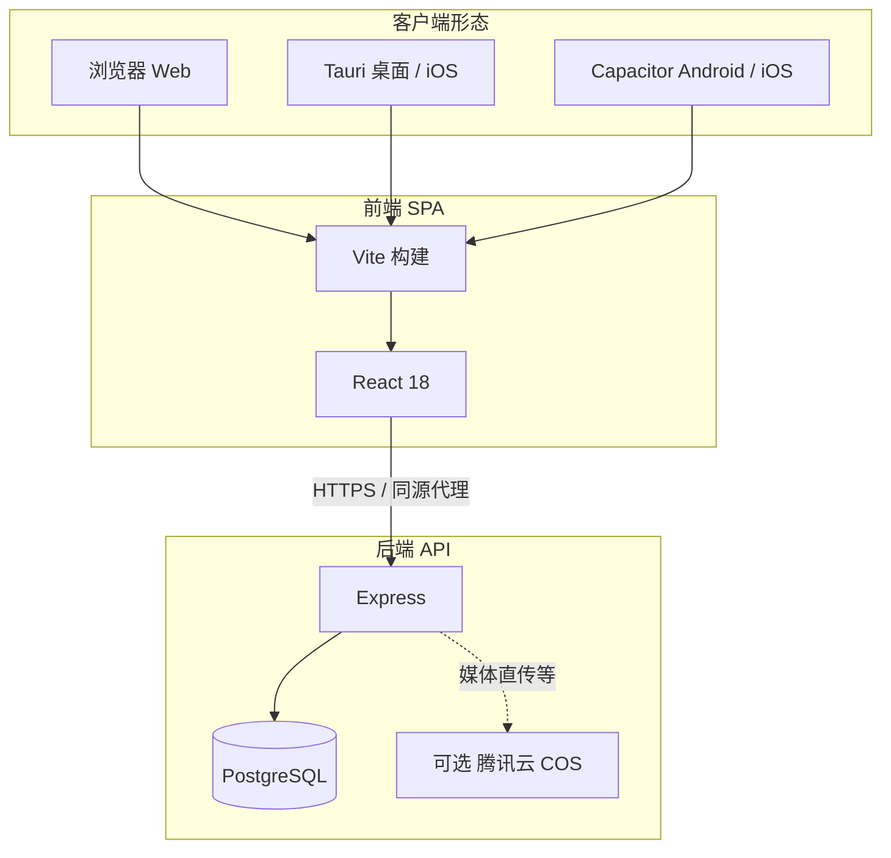

# 产品架构说明（Mikujar / notes-app）

本文描述当前仓库内**前端、后端、多端壳与数据流**的分工与依赖关系，便于 onboarding 与后续演进。

---

## 1. 产品定位

基于 **React + TypeScript** 的笔记应用：以「合集（Collection）树」组织多条「小笔记（NoteCard）」，支持富文本（Tiptap）、附件、标签、日历浏览、提醒、相关笔记、收藏与回收站等能力。

数据可在 **纯本地（localStorage）** 与 **云端同步（HTTP API + PostgreSQL）** 两种模式间切换（见 `appDataMode`）。

---

## 2. 总体拓扑

- **前端**：单页应用，构建产物可静态托管；开发期通过 Vite 代理访问 API。
- **后端**：Node.js **Express**（`server/`），业务数据以 **PostgreSQL** 为主（`storage-pg.js`）；媒体可接 **COS**（`storage.js` / `mediaUpload.js`）。
- **壳**：**Tauri 2**（`src-tauri/`）用于桌面与部分 iOS 场景；**Capacitor 8**（`android/`、`ios/`）用于移动端；二者均加载同一套 Web 资源。

---

## 3. 前端架构

### 3.1 技术栈

| 层级  | 技术                                      |
| --- | --------------------------------------- |
| 框架  | React 18、TypeScript                     |
| 构建  | Vite 5                                  |
| 编辑器 | Tiptap 3                                |
| 原生  | `@tauri-apps/api`、Capacitor（如 Keyboard） |

### 3.2 目录与职责

| 路径                | 职责                                                                   |
| ----------------- | -------------------------------------------------------------------- |
| `src/App.tsx`     | 应用根：路由级状态、时间线/侧栏/弹层编排、与大量业务 hook 的粘合层（已部分拆出到 `appkit`）               |
| `src/appkit/`     | **可复用领域模块**：合集模型、拖拽、日历/搜索、远程同步 hook、侧栏树、卡片行、管理员/手势等（见 `index.ts` 导出） |
| `src/api/`        | HTTP 客户端：合集、用户、健康检查、上传、`/me` 偏好等                                     |
| `src/auth/`       | 登录态：`AuthContext`、Token / Cookie 策略                                  |
| `src/noteEditor/` | 单卡富文本 `NoteCardTiptap`                                               |
| `*.tsx`（根下）       | 独立功能块：`CardDetail`、`UserProfileModal`、`ReminderPickerModal` 等        |
| `*Storage.ts`     | 浏览器侧持久化：本地合集、远程快照缓存、新笔记位置等                                           |

**说明**：目录名使用 `appkit` 而非 `app`，是为避免在 macOS 默认**大小写不敏感**磁盘上与 `App.tsx` 的导入路径冲突。

### 3.3 核心数据流（云端模式）

1. **启动**：`useRemoteCollectionsSync` 根据 `authReady`、`dataMode`、登录态拉取或恢复合集树（含本地快照 `remoteCollectionsCache`、健康检查 `api/health`）。
2. **编辑**：卡片正文在远程模式下经 `useCardTextRemoteAutosave` **防抖 PATCH**；隐藏页面时 flush。
3. **结构**：合集树拖拽、小笔记跨合集/排序由 `useCollectionRowDnD`、`noteCardDrag` / `collectionDrag` 与 API 持久化配合完成。
4. **偏好**：收藏合集 ID、回收站条目等经 `api/mePreferences` 与本地 key（按用户）同步。

### 3.4 本地模式

- 合集树读写 `localCollectionsStorage`；媒体可走浏览器内联或 Tauri 本地目录（`localMediaBrowser` / `localMediaTauri`）。
- 不与服务端合集 API 混写；`apiBase` 仍可能用于登录/配置类请求（见 `apiBase.ts` 注释）。

### 3.5 多端 API 基址

- `src/api/apiBase.ts`：根据是否 **Tauri / Capacitor 原生壳**、`VITE_API_BASE` 等解析 API 根路径；桌面默认可回落到配置的远程 API。

---

## 4. 后端架构（`server/`）

| 模块                   | 说明                                         |
| -------------------- | ------------------------------------------ |
| `src/index.js`       | Express 入口：CORS、JWT/API Token 鉴权、REST 路由注册 |
| `src/storage-pg.js`  | 合集树、卡片 CRUD、收藏与回收站等 **PG 实现**              |
| `src/users.js`       | 用户注册、登录、角色、头像等                             |
| `src/mediaUpload.js` | 上传模式探测、直传 COS 计划与回调                        |
| `src/db.js`          | `pg` 连接池                                   |
| `scripts/`           | JSON→PG 迁移、增量 schema 等                     |

认证形态包括：**JWT**（用户会话）、**API_TOKEN**（管理/脚本）、以及环境驱动的 **admin 门槛**（`users.js` / `index.js` 内逻辑）。

---

## 5. 构建与交付

| 命令                                  | 用途                                                |
| ----------------------------------- | ------------------------------------------------- |
| `npm run dev`                       | 前端开发服务器                                           |
| `npm run build`                     | `tsc -b` + `vite build`，`postbuild` 执行 `cap sync` |
| `npm run server` / `server:dev`     | 启动 API                                            |
| `npm run tauri:dev` / `tauri:build` | Tauri 开发与打包                                       |
| `npm run cap:ios` / `cap:android`   | 打开原生工程                                            |

静态资源可经 `build:deploy` 等脚本与 `server/public` 对齐（见 `package.json`）。

---

## 6. `appkit` 模块一览（按功能）

- **模型与存储键**：`collectionModel`、`workspaceStorage`、`initialWorkspace`
- **日历与搜索**：`searchAndCalendar`、`CalendarBrowse`、`dateUtils`
- **布局与常量**：`masonryLayout`、`appConstants`、`mobileNavSwipe`
- **拖拽**：`noteCardDrag`、`collectionDrag`；UI 侧 `useCollectionRowDnD`
- **远程加载**：`useRemoteCollectionsSync`
- **用户管理**：`useUserAdmin`、`UserAdminModal`
- **移动端**：`useMobileNavSwipe`
- **侧栏树**：`CollectionSidebarTree`、`SidebarWorkspace` 相关图标与身份区
- **时间线卡片**：`NoteTimelineCard`、`TrashNoteCardRow`
- **弹层**：`CollectionContextMenu`、`CollectionDeleteDialog`、`RelatedCardsSidePanel`

---

## 7. 扩展与注意事项

- **新功能优先**：能放进 `appkit` 的纯函数与小组件尽量不放回臃肿的 `App.tsx`。
- **数据模式**：改存储或同步逻辑时同时考虑 `local` / `remote` 分支与 `canEdit` 推导（`App.tsx` 内 `useMemo`）。
- **原生壳**：新增需要 Cookie/文件/域名的能力时，核对 `apiBase`、`authUsesHttpOnlyCookie` 与 CORS 配置。

---

*文档版本：与仓库当前结构一致；若目录或脚本有变，请同步更新本节。*